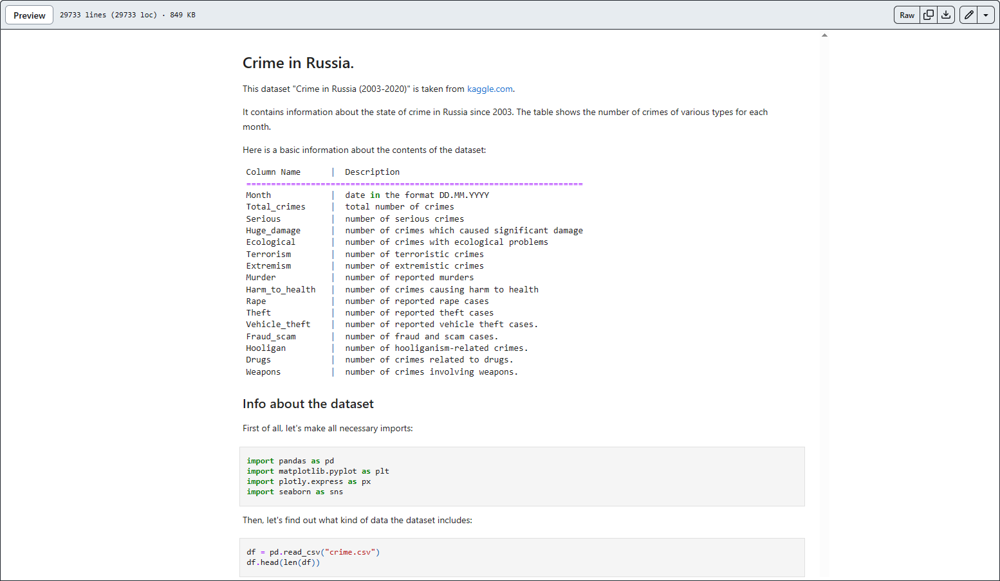
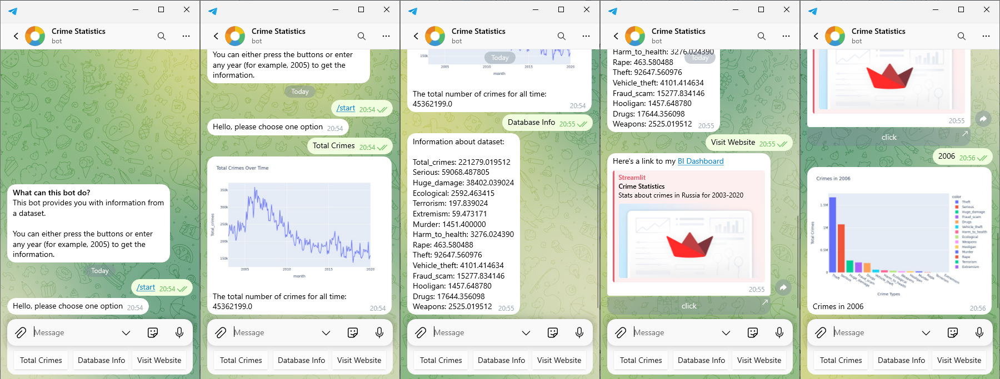
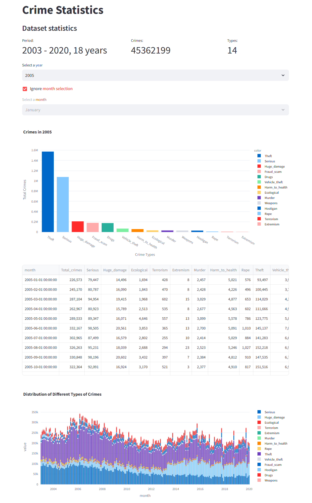
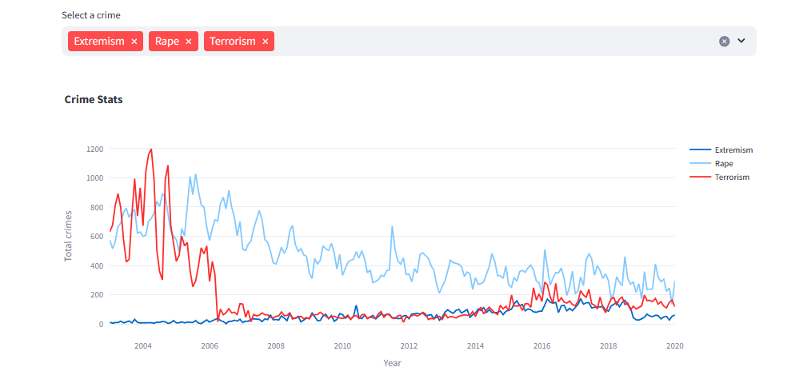

<h1 align="center">Crime Statistics</h1>
<h4 align="center">Analysis of the crime data set in Russia for the period from 2003 to 2020</h4>

## Dataset
The dataset can be found here: [link](https://www.kaggle.com/datasets/tsarkov90/crime-in-russia-20032020)

## Notebook
You can open the notebook directly on the GitHub

But since Plotly charts don't work here, I recommend you open it elsewhere (google colab or vs code)

## Client + API
Flask Web Server (API) + Telegram Bot (Client)

The Telegram bot was available [here](https://t.me/crime_stats_bot), but now it's off.

## BI Data App
The Streamlit application is available [here](https://crime-stats.streamlit.app/)

